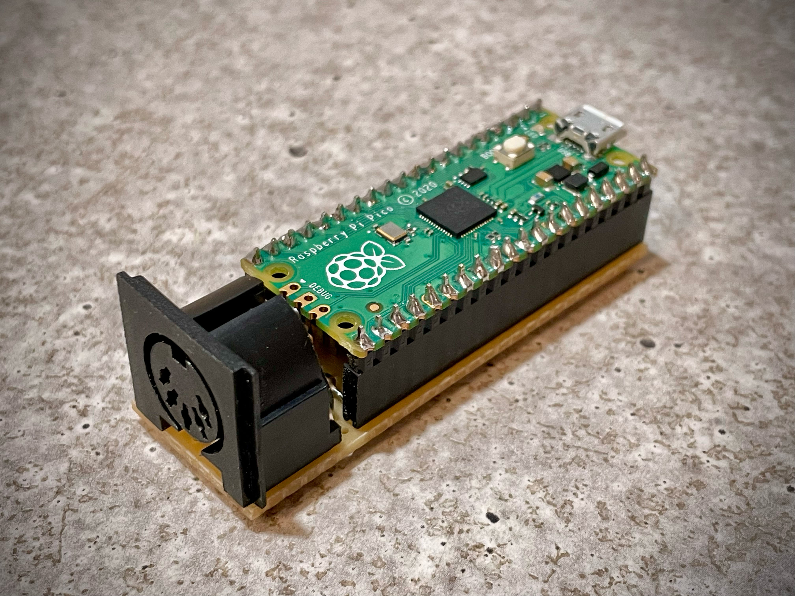
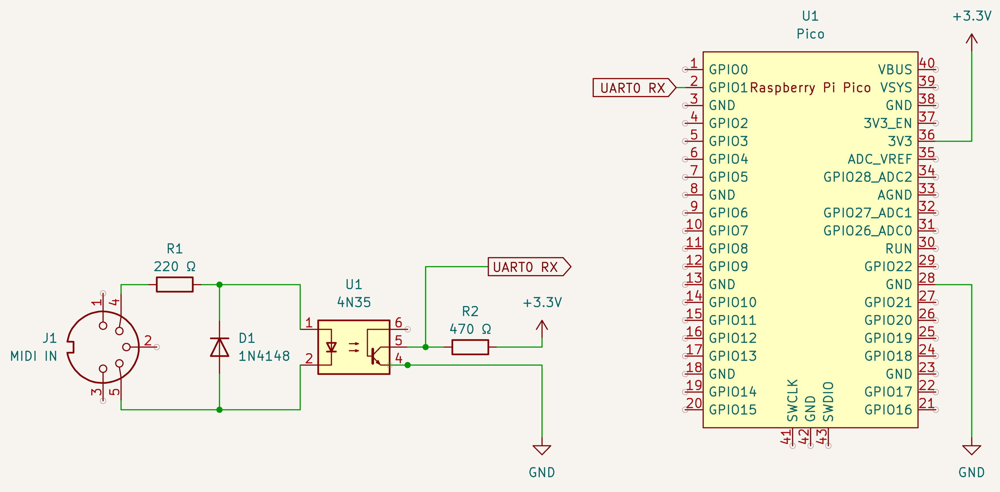
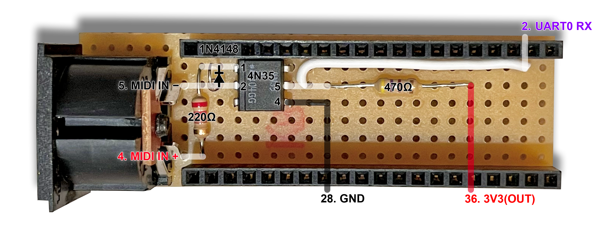

# Musician MIDI Pico Translator

Plug-and-play MIDI to USB translator interface for the [Musician MIDI](https://github.com/LenweSaralonde/MusicianMIDI) World of Warcraft add-on, based on a [Raspberry Pi Pico](https://www.raspberrypi.com/products/raspberry-pi-pico/).



The device consists of:
* A HID keyboard that translates incoming MIDI messages into keystrokes for the [Musician MIDI](https://github.com/LenweSaralonde/MusicianMIDI) add-on running in World of Warcraft.
* A standard MIDI to USB interface that can be used simultaneously with any software synthesizer or music production software to mitigate the audio latency problem in World of Warcraft.

### Features
* Compatible with Mac and PC.
* Plug-and-play (no driver required).
* Supports the QWERTY, AZERTY and QWERTZ keyboard layouts.
* N-Key rollover (all keys can play at the same time).
* Minimalistic design for low-cost and easy building using basic off-the-shelf components and tools.

## How to use

Connect the DIN jack to your controller MIDI OUT and the USB to your computer.

Press the **onboard button** to choose the desired keyboard mode. The onboard LED will then blink accordingly to the chosen mode:
1. **QWERTY** &ndash; 1 long and 1 short blinks
2. **AZERTY** &ndash; 1 long and 2 short blinks
3. **QWERTZ** &ndash; 1 long and 3 short blinks
4. **Disabled** &ndash; 1 long blink

The selected mode is saved when the device is disconnected. The onboard LED indicates which mode is active on power on, then it monitors the incoming MIDI messages.

## Schematic

The circuit consists of a minimalistic MIDI IN shield for the Raspberry Pi Pico.



It's built around the 4N35 optocoupler and it's designed accordingly to the MIDI specifications to limit potential damage to your gear in case of incorrect connection.

Any other MIDI shield design works, as long as it's compatible with the Raspberry Pi Pico and routes the MIDI IN to the Pico `UART0 RX` pin (2).

## Build

The easiest solution is to build the circuit on a perfboard.

The components are placed under the Raspberry Pi to reduce the device footprint.



Components list:
* 1x Raspberry Pi Pico
* 1x 67 x 21 mm (26 x 8 holes) Single-sided zero PCB / perfboard
* 2x 20-way header sockets
* 1x 180° DIN socket
* 1x 4N35 optocoupler
* 1x 1N4148 diode
* 1x 220 Ω resistor
* 1x 470 Ω resistor
* Wire

The DIN socket legs may be too large to fit in the perfboard holes, don't hesitate to enlarge the holes with a mini drill.

Insert the Raspberry Pi Pico with the USB port to the opposite direction of the DIN socket.

Once completed, glue the circuit on a piece of wood or plastic to prevent the solder points to scratch your equipment.

## Alternative hardware solutions

If you don't want to build the MIDI shield yourself, you can buy some that are already assembled, tested and ready to be flashed:
* [Midimuso Pico MIDI full kit with Raspberry Pi Pico](https://midimuso.co.uk/index.php/product/pico-midi-built-including-pi-pico-board/) — £35

## How to flash the Raspberry Pi Pico

### 1. Download and install Arduino IDE

1. Go to **https://www.arduino.cc/en/software**
2. Select your operating system (it should be already selected) then click the **Download** button.
3. Open the downloaded file and follow the installer.
4. Launch **Arduino IDE**.

### 2. Add the Raspberry Pi Pico board package

Arduino IDE doesn't know about the Pico out of the box. You need to tell it where to find the board files.

1. Open **Preferences**.
   - macOS: `Arduino IDE` menu → `Preferences`
   - Windows: `File` menu → `Preferences`
2. Find the field labelled **"Additional boards manager URLs"**.
3. Click the small icon to the right of that field (it looks like two overlapping windows).
4. A text box opens. Paste this URL on a new line:
   ```
   https://github.com/earlephilhower/arduino-pico/releases/download/global/package_rp2040_index.json
   ```
5. Click **OK** to close the text box, then **OK** again to close Preferences.
6. Go to **Tools → Board → Boards Manager**.
7. In the search box type `RP2040`.
8. Find **"Raspberry Pi Pico/RP2040/RP2350"** by **Earle F. Philhower, III** — ⚠️ make sure it says his name, not "Arduino".
9. Click **Install** — this downloads about 250 MB and takes a few minutes.
10. When it finishes, close the Boards Manager.

### 3. Select the correct board and settings

1. Go to **Tools → Board → Raspberry Pi Pico/RP2040/RP2350** then select **Raspberry Pi Pico** — it should be the first option.
2. Go to **Tools**, find the option that begins with **USB Stack:** then choose **Adafruit TinyUSB**.

> ⚠️ **The USB Stack setting is critical.** If you don't see the USB Stack option in the Tools menu, you selected the wrong board package (Arduino's instead of Earle's). Go back to Step 2 and make sure you installed the correct one.

### 4. Open the sketch

1. Go to **File → Open**.
2. Navigate to and select `musician-midi-pico-translator.ino`.
3. The sketch opens in the editor — you should see code starting with a large comment block.

### 5. Connect the Pico in bootloader mode

1. **Hold down the BOOTSEL button** — the small white button on the Pico board.
2. While still holding it, **plug the USB cable in**.
3. **Release the button**.

The Pico now appears as a USB drive called **RPI-RP2** on your desktop (like a flash drive). This confirms it's ready to receive the program.

> ⚠️ If you don't see the RPI-RP2 drive, your USB cable is charge-only and has no data wires. Try a different cable.

### 6. Upload the sketch

1. In Arduino IDE, go to **Tools → Port** and select the port that mentions **UF2 Board** or **RPI-RP2**.
2. Click the **Upload button** — the right-pointing arrow `→` in the top-left toolbar
3. Arduino IDE will:
   - Compile the code (bottom panel shows progress — takes 30–60 seconds the first time).
   - Copy the compiled file onto the Pico automatically.
4. The RPI-RP2 drive disappears from your desktop — **this is normal and means it worked**. On macOS, you may get a warning notification that says the drive was not ejected properly, you can safely dismiss this warning.
5. Wait for the **Done uploading** message in Arduino IDE.
6. The translator is now operational.

> ℹ️ On macOS, a configuration window may appear the first time, inviting you to configure your "Generic" keyboard. It's not required and you can just click "Quit" to close the window.

### Update the software

To update the Raspberry Pi Pico software, just launch Arduino IDE then repeat from step 3.